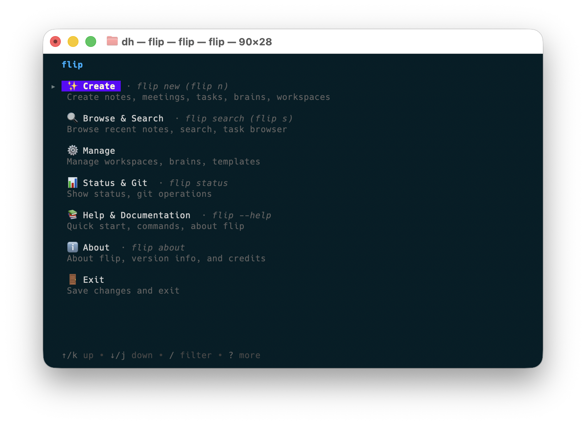
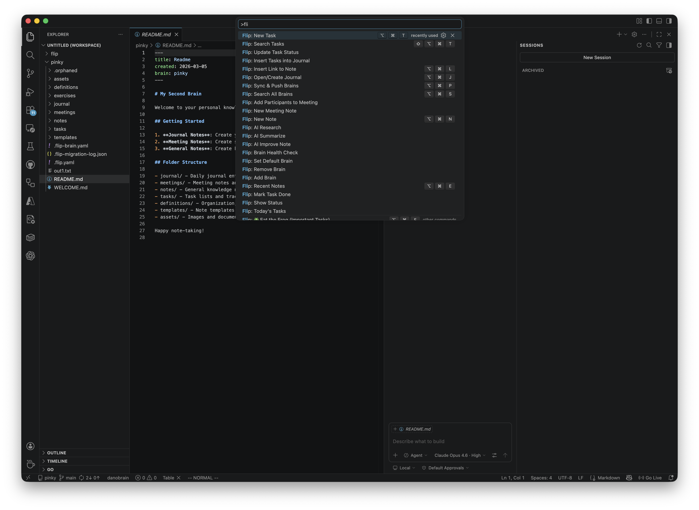

# flip

> Steroids for your 2nd brain 🧠
>
> *…or, more honestly: a CLI for working with markdown-based knowledge folders. flip runs alongside tools like Obsidian, Logseq, Dendron and Foam by reading their on-disk layout — it does not replace them.*

## Features

- Daily journals — one command to open today's entry
- Notes with templates, frontmatter and search
- Markdown-based task management with a TUI browser
- Exercise tracking (sessions, plans, progress)
- Multiple "brains" (knowledge folders) with workspace switching
- VS Code integration (tasks, commands, status bar)
- Optional AI assist for research, summaries and edits
- Pandoc-based export to PDF / HTML / DOCX

## Quick Start

```bash
# Install
go install github.com/httrp/flip/cmd/flip@latest

# Or build from source
git clone https://github.com/httrp/flip.git
cd flip && make build

# Create your first brain
flip brain init ~/my-brain

# Open the interactive menu
flip
```

## Screenshots

### Interactive menu


### VS Code integration


## Common commands

```bash
flip journal              # today's journal
flip note "My Idea"       # new note
flip task new             # new task
flip task browse          # task browser (TUI)
flip exercise new         # new exercise
flip export convert notes/idea.md --format pdf
flip status               # overview
```

## Documentation

| Document | Description |
|----------|-------------|
| [QUICKSTART](docs/QUICKSTART.md) | Get started in 5 minutes |
| [COMMANDS](docs/COMMANDS.md) | Full command reference |
| [VSCODE](docs/VSCODE.md) | VS Code integration guide |
| [FEATURES](docs/FEATURES.md) | Feature overview |
| [DEVELOPMENT](docs/DEVELOPMENT.md) | Architecture and internals |

## Brain compatibility

flip can detect and work with several markdown-based knowledge systems. "Compatible" means flip can read the on-disk layout and operate on the files; it does **not** mean feature parity with the original tool.

| Type | Detection | Status |
|------|-----------|--------|
| **flip** (native) | `.flip-brain.yaml` | Full support |
| **Obsidian** | `.obsidian/` | Compatible — vault layout, wikilinks, daily notes. Plugins, Canvas and Bases are not interpreted. |
| **Logseq** | `.logseq/` | Read & migrate. Property bullets, queries and block refs are normalized, not preserved round-trip. |
| **Dendron** | `dendron.yml` | Read & migrate. The hierarchical schema system is not enforced. |
| **Foam** | `.foam/` | Compatible (treated similarly to Obsidian). |
| **Plain Markdown** | any folder | Supported |

For the full compatibility matrix and limitations, see [BRAIN_TYPES_REFERENCE](docs/BRAIN_TYPES_REFERENCE.md).

## VS Code integration

```bash
# Install the bundled VS Code tasks
flip vscode install

# Then: Cmd+Shift+P → "Tasks: Run Task" → "Flip: ..."
```

## Getting started

First time? Run the interactive quickstart:

```bash
flip quickstart
```

It walks you through creating or joining a workspace, creating a brain (or connecting an existing one) and writing your first journal entry. For a manual setup, see [QUICKSTART.md](docs/QUICKSTART.md).

## Concepts

- **Brain** — a folder containing your knowledge base (notes, tasks, journals, meetings). flip works with plain markdown and detects supported brain formats automatically.
- **Workspace** — a group of brains with one active brain. Configuration is local; there is no cloud sync.

For the architecture overview and design notes, see [docs/DEVELOPMENT.md](docs/DEVELOPMENT.md) and [docs/ARCHITECTURE_DIAGRAMS.md](docs/ARCHITECTURE_DIAGRAMS.md).

## Development

Contributions are welcome. See [CONTRIBUTING.md](CONTRIBUTING.md) for setup, build and test instructions.

```bash
make build      # build CLI + extension
make test       # run tests
make lint       # go vet
make dev-link   # symlink the binary for local dev (macOS/Linux)
```

## Acknowledgments

flip is compatible with vaults and graphs from these projects, and owes a lot to the conventions they established:

- [Obsidian](https://obsidian.md/)
- [Logseq](https://logseq.com/)
- [Dendron](https://www.dendron.so/)
- [Foam](https://foambubble.github.io/)

If you already use one of these tools, flip is meant to sit next to it, not to take it over.

## License

MIT — see [LICENSE](LICENSE).
